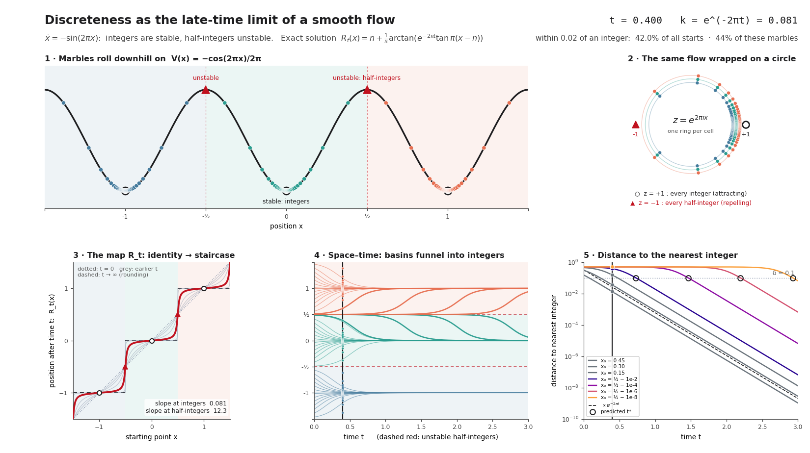

# Discreteness as the Late-Time Limit of a Smooth Flow

[](https://doi.org/10.5281/zenodo.23202008)

*An exactly solvable gradient flow whose time-evolution maps are smooth bijections of the real line at every finite time, and whose infinite-time limit is rounding to the nearest integer.*

---


## Abstract

We study the gradient flow of the periodic potential

$$
V(x) = -\frac{\cos(2\pi x)}{2\pi}.
$$

Integers are its stable fixed points and half-integers its unstable ones. A tangent substitution linearizes the flow, which gives a closed-form solution. At every finite time the flow is a smooth, strictly increasing bijection of the real line; the family of maps forms a one-parameter group; and as time tends to infinity every open cell between consecutive half-integers collapses onto the integer it contains. "Integer-valued" therefore appears as the endpoint of a continuous process with a single, exactly composable resolution parameter, the time. The integers are not generated by the flow: they enter through the period of the potential. What the flow provides is an exactly solvable, exactly composable route to that prescribed discrete target. We also give the exact time it takes to resolve a point to a given accuracy; it grows only logarithmically.

This note states the solution and the main results. Proofs, further properties, the geometric interpretation as a hyperbolic Möbius dilation of the circle, related work and the verification details are in **[APPENDIX.md](APPENDIX.md)**.

---

## Files and usage

| File | Purpose |
| --- | --- |
| `README.md` | this note: the idea, the exact solution, four results, the resolution time |
| `APPENDIX.md` | proofs, further properties, geometric picture, related work, verification details |
| `discreteness.py` | interactive explorer, figures and GIF; double-precision self-test of the mathematics |
| `verify_paper.py` | 50-digit verification of every statement in the note and the appendix, plus a cross-check of `discreteness.py` |
| `prove_paper.py` | exact symbolic proof (computer algebra) of every algebraic identity in the note and the appendix |
| `discreteness_dashboard.png` | the figure above, produced by `python discreteness.py --snapshot 0.4` |

Requirements: Python ≥ 3.9. `discreteness.py` needs `numpy` and `matplotlib` (≥ 3.5); `verify_paper.py` needs `mpmath` (and, for its optional cross-check, `numpy` and `discreteness.py` in the same directory); `prove_paper.py` needs `sympy` and `mpmath`.

```bash
python discreteness.py                  # interactive explorer (slider + Play)
python discreteness.py --snapshot 0.4   # regenerate the figure above
python discreteness.py --selftest       # double-precision self-test
python verify_paper.py                  # 50-digit verification; exit status 0 = all checks passed
python prove_paper.py                   # exact symbolic proofs; exit status 0 = all passed
```

---

## 1. The idea

Consider the equation of motion

$$
\dot x = -V'(x) = -\sin(2\pi x).
$$

Its fixed points are the integers and the half-integers. The linearization of the vector field there is $-2\pi\cos(2\pi x)$, which equals $-2\pi$ at the integers (stable) and $+2\pi$ at the half-integers (unstable).

A point inside the open cell around an integer is drawn to that integer; a point exactly on a half-integer stays there. The time-$t$ map of the flow is the object of interest. It is invertible for every finite time, because the flow can be run backwards. Discreteness appears only in the limit, where the map stops being injective.

---

## 2. The exact solution

Throughout, $k = e^{-2\pi t}$, $t$ is any real time, and $R_t$ denotes the time-$t$ map.

### 2.1 Linearizing the flow

Work inside the open cell around the integer $n$ and set $u = \tan\pi(x-n)$. The double-angle identity gives $\sin 2\pi x = 2u/(1+u^2)$, so

$$
\dot u = \pi(1+u^{2})\,\dot x = -\pi(1+u^{2})\,\frac{2u}{1+u^{2}} = -2\pi u .
$$

The tangent coordinate linearizes the flow: $u(t) = e^{-2\pi t}u(0)$. Taking the arctangent gives the **cell form**

$$
R_t(x) = n + \frac{1}{\pi}\arctan\!\Big(k\,\tan \pi(x-n)\Big), \qquad x \in \left(n-\tfrac12,\; n+\tfrac12\right),
$$

together with $R_t(n+\tfrac12) = n+\tfrac12$ on the cell boundaries. Equivalently, wherever the tangent is defined,

$$
\tan\!\big(\pi R_t(x)\big) = k\,\tan(\pi x).
$$

### 2.2 One formula on the whole line

The cell form is undefined at the half-integers. A single expression that is valid everywhere uses

$$
D = (1+\cos 2\pi x) + k\,(1-\cos 2\pi x),
$$

which is strictly positive for every real $x$ and every $k>0$ (the two brackets are non-negative and never vanish together):

$$
R_t(x) = x - \frac{1}{\pi}\arctan\!\left(\frac{(1-k)\,\sin 2\pi x}{D}\right).
$$

This is smooth in $(x,t)$ on the whole plane, with no branch cuts and no case distinction, it fixes every half-integer (the numerator vanishes there), and it agrees with the cell form on every open cell (Appendix A.3).

---

## 3. Results

Throughout, $x$ and $t$ are real and $n$ is an integer. Proofs are in Appendix B.

**Result 1 (it solves the equation).** The map starts at the identity and satisfies the equation of motion,

$$
R_0(x) = x, \qquad \partial_t R_t(x) = -\sin\!\big(2\pi R_t(x)\big),
$$

and it linearizes the tangent: $\tan(\pi R_t(x)) = e^{-2\pi t}\tan(\pi x)$ whenever $\cos\pi x \ne 0$.

*Proof idea.* Differentiate the cell form in $t$ and use $\sin(2\arctan z) = 2z/(1+z^2)$.

**Result 2 (smooth strictly increasing bijection).** The spatial derivative is

$$
\partial_x R_t(x) = \frac{k}{\cos^{2}\pi x + k^{2}\sin^{2}\pi x} > 0,
$$

and the map commutes with integer shifts, $R_t(x+n) = R_t(x) + n$. Consequently each $R_t$ is a smooth, strictly increasing bijection of the real line onto itself.

*Proof idea.* Differentiate the cell form in $x$; a continuous, strictly increasing map that commutes with integer shifts is onto.

**Result 3 (group law).** For all real times,

$$
R_{s+t} = R_s \circ R_t, \qquad R_{-t} = R_t^{-1}.
$$

So the family is a genuine group of diffeomorphisms of the line for finite time, not merely a semigroup. Irreversibility arises only in the limit.

*Proof idea.* Both sides solve $\dot y = -\sin 2\pi y$ with the same initial value, and the right-hand side is globally Lipschitz, so the solution is unique.

**Result 4 (late-time limit).** On every open cell the map collapses to the integer,

$$
\lim_{t\to\infty} R_t(x) = n, \qquad x \in \left(n-\tfrac12,\; n+\tfrac12\right).
$$

The limiting map is rounding to the nearest integer, except on the half-integers, which remain fixed. The convergence is pointwise, and uniform only on compact subsets of the open cells: for every finite $t$,

$$
\sup_x \big|R_t(x) - \mathrm{round}(x)\big| = \tfrac12,
$$

because points near a half-integer have barely moved. Appendix D makes this quantitative.

*Proof idea.* $k\to0$ and the arctangent is continuous at $0$.

The fixed points keep their linearized rates exactly: the slope of $R_t$ is $e^{-2\pi t}$ at the integers and $e^{+2\pi t}$ at the half-integers (Appendix C.1). The potential decreases along the flow (C.2), each point approaches its integer monotonically (C.3), and no two points are pushed together faster than $e^{-2\pi t}$ allows (C.4).

---

## 4. How long does it take to resolve a point?

Take a point at distance $\varepsilon$ from a half-integer, $x = n + \tfrac12 - \varepsilon$ with $0<\varepsilon<\tfrac12$, and ask for the time $t_\star$ at which it lies within distance $\delta$ of its integer $n$, with $0<\delta<\tfrac12$. For this point $\tan\pi(x-n) = \cot\pi\varepsilon$ exactly, so the condition $R_t(x)-n=\delta$ reads $\arctan(k\cot\pi\varepsilon)=\pi\delta$, that is

$$
k = \tan(\pi\delta)\,\tan(\pi\varepsilon).
$$

Solving for the time gives an exact result:

$$
t_\star(\varepsilon,\delta)
= \frac{1}{2\pi}\,\ln\frac{1}{\tan(\pi\delta)\,\tan(\pi\varepsilon)}
= \frac{1}{2\pi}\ln\cot\pi\varepsilon + \frac{1}{2\pi}\ln\cot\pi\delta .
$$

It is symmetric in $\varepsilon$ and $\delta$ and splits into one term per scale. The time is positive if and only if $\varepsilon+\delta<\tfrac12$; otherwise the point starts within $\delta$ of its integer.

**Small-scale form.** For $\varepsilon,\delta\ll1$, $\tan z\approx z$ gives

$$
t_\star \approx \frac{1}{2\pi}\,\ln\frac{1}{\pi^{2}\,\varepsilon\,\delta}.
$$

The resolution time therefore grows only **logarithmically** in both the distance from the unstable point and the target accuracy. The estimate always overshoots the exact time, by about $\frac{\pi}{6}(\varepsilon^2+\delta^2)$; numerical values are in Appendix F.

**No finite time resolves everything.** At a fixed time $t$, the starts that are still unresolved are exactly those within

$$
\varepsilon_c(t) = \frac1\pi\arctan\!\frac{k}{\tan\pi\delta}
$$

of a half-integer. Since $\varepsilon_c(t)>0$ at every finite time, the unresolved fraction of a uniformly distributed start, $2\varepsilon_c(t)$, is positive at every finite time, although it decays exponentially (Appendix D).

---

## 5. Scope and status

- **What is claimed.** The closed form, the four results and the resolution time are exact statements about the flow $\dot x=-\sin 2\pi x$. The integers enter only through the period of the potential; the flow does not generate them.
- **Related work.** After rescaling, the equation is the Adler equation with zero detuning, and its tangent half-angle solution is classical. The Möbius structure behind the group law is the single-oscillator case of the Watanabe–Strogatz reduction. What this note adds is the packaging: the exact group structure, the quantified non-uniformity of the limit, and the reading of time as a resolution parameter. This rests on an informal web search only; novelty has not been established (Appendix G, with references and possible uses).
- **Verification.** The algebraic steps are proved exactly in computer algebra (`prove_paper.py`), and every statement is cross-checked in 50-digit arithmetic (`verify_paper.py`). Three standard theorems (Picard–Lindelöf uniqueness, surjectivity of a continuous strictly increasing map commuting with shifts, the mean value theorem) are applied by hand, and nothing is formalised in a proof assistant. Details in Appendix H.
