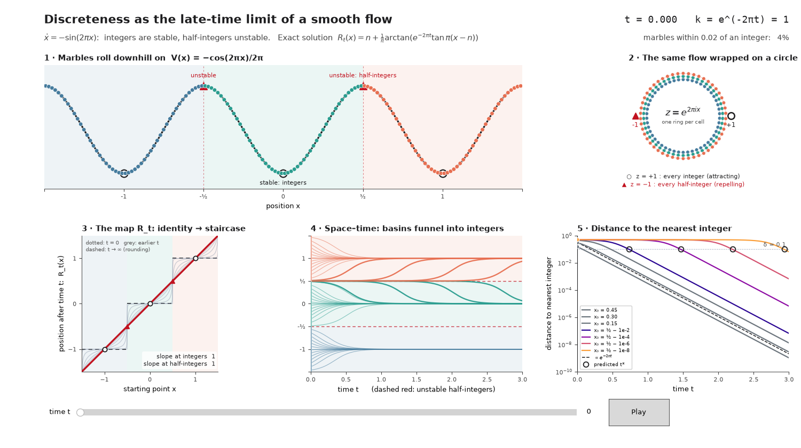

# Discreteness as the Late-Time Limit of a Smooth Flow

*An exactly solvable gradient flow whose time-evolution maps are smooth bijections of the real line at every finite time, and whose infinite-time limit is rounding to the nearest integer.*

---

## Abstract

We study the gradient flow of the periodic potential

$$
V(x) = -\frac{\cos(2\pi x)}{2\pi}.
$$

Integers are its stable fixed points and half-integers its unstable ones. The flow can be solved in closed form. At every finite time it is a smooth, strictly increasing bijection of the real line; the family of maps forms a one-parameter group; and as time tends to infinity every open cell between consecutive half-integers collapses onto the integer it contains. "Integer-valued" therefore appears as the endpoint of a continuous process with a single, exactly composable resolution parameter, the time. We state the closed form, derive the main properties, give a geometric interpretation as a hyperbolic Möbius dilation of the circle, and estimate how long it takes to resolve a point to a given accuracy.

---

## 1. The idea

Consider the equation of motion

$$
\dot x = -V'(x) = -\sin(2\pi x).
$$

Its fixed points are the half-integers and the integers. Linearizing the vector field gives

$$
\frac{d}{dx}\big(-\sin 2\pi x\big) = -2\pi\cos(2\pi x),
$$

which equals

$$
-2\pi \ \text{ at the integers (stable)}, \qquad +2\pi \ \text{ at the half-integers (unstable)}.
$$

Starting from a point inside the open cell around an integer, the trajectory is drawn to that integer. Starting exactly on a half-integer, it stays there. The time-t map of the flow is the object of interest. It is invertible for every finite time, because the flow can be run backwards, and discreteness appears only in the limit, where the map becomes non-injective.

---

## 2. The exact solution

### 2.1 Closed form

Define the contraction factor

$$
k = e^{-2\pi t},
$$

and the two denominators

$$
D = (1+\cos 2\pi x) + k\,(1-\cos 2\pi x), \qquad
E = (1+\cos 2\pi x) + k^{2}\,(1-\cos 2\pi x).
$$

Both are strictly positive for every real position and every positive factor, because the two brackets are non-negative and never vanish simultaneously. The time-t map is

$$
R_t(x) = x - \frac{1}{\pi}\arctan\!\left(\frac{(1-k)\,\sin 2\pi x}{D}\right).
$$

Since the denominator never vanishes and the arctangent is smooth, this expression is a smooth function of position and time on the whole real line, with no branch cuts.

### 2.2 The same map in cell form

Inside the open cell around the integer n, the map takes the simpler form

$$
R_t(x) = n + \frac{1}{\pi}\arctan\!\Big(e^{-2\pi t}\,\tan \pi(x-n)\Big), \qquad x \in \left(n-\tfrac12,\; n+\tfrac12\right),
$$

and on the cell boundaries

$$
R_t\!\left(n+\tfrac12\right) = n+\tfrac12.
$$

### 2.3 Why this is the solution

Work inside one cell and set

$$
u = \tan \pi(x-n).
$$

Using the double-angle identity for the sine,

$$
\sin 2\pi x = \frac{2u}{1+u^{2}},
$$

the equation of motion becomes

$$
\dot u = \pi(1+u^{2})\,\dot x = -\pi(1+u^{2})\,\frac{2u}{1+u^{2}} = -2\pi u.
$$

The tangent coordinate therefore **linearizes the flow**, and its solution is

$$
u(t) = e^{-2\pi t}\,u(0).
$$

Taking the arctangent gives the cell form. To pass to the global closed form, write

$$
T = \tan\pi(x-n).
$$

Then the three trigonometric quantities become

$$
\sin 2\pi x = \frac{2T}{1+T^{2}}, \qquad
1+\cos 2\pi x = \frac{2}{1+T^{2}}, \qquad
1-\cos 2\pi x = \frac{2T^{2}}{1+T^{2}},
$$

so that

$$
q := \frac{(1-k)\sin 2\pi x}{D} = \frac{(1-k)\,T}{1+kT^{2}}.
$$

A direct computation gives

$$
\tan\!\big(\pi(x-n) - \arctan q\big) = \frac{T-q}{1+qT} = \frac{T(kT^{2}+k)}{1+T^{2}} = kT.
$$

Treating the factor as a continuous parameter starting from the value one, where the correction term vanishes, the angle on the left stays strictly between minus and plus a quarter turn (the tangent is finite throughout). Hence it equals the arctangent of the right-hand side, and the closed form and the cell form coincide. The closed form has the advantage of being valid on the cell boundaries too.

### 2.4 The algebraic core

Every derivative computation below reduces to one polynomial identity:

$$
D^{2} + \big((1-k)\sin 2\pi x\big)^{2} = 2E.
$$

To verify it, substitute

$$
\sin^{2}2\pi x = (1-\cos 2\pi x)(1+\cos 2\pi x)
$$

and expand. The sum becomes

$$
(1+\cos 2\pi x)^{2} + (1-\cos 2\pi x)(1+\cos 2\pi x)(1+k^{2}) + k^{2}(1-\cos 2\pi x)^{2},
$$

which factors as

$$
2(1+\cos 2\pi x) + 2k^{2}(1-\cos 2\pi x) = 2E.
$$

This is the only place where the Pythagorean identity is needed.

---

## 3. Results

Throughout, the position is a real number, the time is a real number, and the integer index is any integer unless stated otherwise.

**Result 1 (it solves the equation).** The map starts at the identity and satisfies the equation of motion:

$$
R_0(x) = x, \qquad \frac{\partial}{\partial t} R_t(x) = -\sin\!\big(2\pi R_t(x)\big).
$$

Moreover, the sine of the transformed angle has a closed form,

$$
\sin\!\big(2\pi R_t(x)\big) = \frac{2k\,\sin 2\pi x}{E}.
$$

**Result 2 (smooth strictly increasing bijection).** The spatial derivative is

$$
\frac{\partial}{\partial x} R_t(x) = \frac{2k}{E} > 0,
$$

and the map commutes with integer shifts,

$$
R_t(x+n) = R_t(x) + n.
$$

Consequently each time-t map is a strictly increasing bijection of the real line onto itself.

**Result 3 (fixed points and their slopes).** Integers and half-integers are fixed at every time, with exact slopes

$$
\partial_x R_t(n) = e^{-2\pi t}, \qquad \partial_x R_t\!\left(n+\tfrac12\right) = e^{+2\pi t}.
$$

Integers contract and half-integers expand, with exactly the rates predicted by the linearization.

**Result 4 (group law).** For all real times,

$$
R_{s+t} = R_s \circ R_t, \qquad R_{-t} = R_t^{-1}.
$$

So the family is a genuine group of diffeomorphisms of the line for finite time, not merely a semigroup. Irreversibility arises only in the limit.

**Result 5 (late-time limit).** On every open cell the map collapses to the integer:

$$
\lim_{t\to\infty} R_t(x) = n, \qquad x \in \left(n-\tfrac12,\; n+\tfrac12\right).
$$

The limiting map is rounding to the nearest integer, except on the half-integers, which remain fixed.

**Result 6 (dissipation).** The potential is a Lyapunov function:

$$
\frac{d}{dt}\, V\big(R_t(x)\big) = -\sin^{2}\!\big(2\pi R_t(x)\big) \le 0.
$$

**Result 7 (linearizing form).** Whenever the tangent is defined,

$$
\tan\!\big(\pi R_t(x)\big) = e^{-2\pi t}\,\tan(\pi x), \qquad \cos(\pi x)\neq 0.
$$

**Result 8 (monotone approach to the integers).** For non-negative times, the distance to the nearest integer never increases along the flow:

$$
|R_t(x) - n| \le |R_s(x) - n|, \qquad 0 \le s \le t, \quad x \in \left[n-\tfrac12,\; n+\tfrac12\right].
$$

Each closed cell is mapped into itself.

**Result 9 (resolution bounds).** For non-negative time, no two points are brought together faster than the contraction factor allows:

$$
e^{-2\pi t}\,|x-y| \;\le\; |R_t(x) - R_t(y)| \;\le\; e^{2\pi t}\,|x-y|, \qquad t \ge 0.
$$

---

## 4. Proofs

**Results 1 and 2.** Inside a cell, differentiate the cell form. With respect to time, using the derivative of the contraction factor,

$$
\frac{\partial k}{\partial t} = -2\pi k,
$$

one obtains

$$
\frac{\partial R_t}{\partial t} = \frac{1}{\pi}\cdot\frac{T\,\partial_t k}{1+k^{2}T^{2}} = -\frac{2kT}{1+k^{2}T^{2}}.
$$

On the other hand, the double-angle formula for the sine applied to the arctangent gives

$$
\sin\!\big(2\pi R_t\big) = \frac{2kT}{1+k^{2}T^{2}},
$$

which proves the equation of motion. Converting the tangent back to trigonometric functions of the doubled angle gives the closed form

$$
\sin\!\big(2\pi R_t(x)\big) = \frac{2k\sin 2\pi x}{E}.
$$

For the spatial derivative,

$$
\frac{\partial R_t}{\partial x} = \frac{k\sec^{2}\pi(x-n)}{1+k^{2}\tan^{2}\pi(x-n)} = \frac{k}{\cos^{2}\pi(x-n)+k^{2}\sin^{2}\pi(x-n)} = \frac{2k}{E},
$$

using

$$
\cos^{2}\pi(x-n) = \frac{1+\cos 2\pi x}{2}, \qquad \sin^{2}\pi(x-n) = \frac{1-\cos 2\pi x}{2}.
$$

On the cell boundaries every point is fixed (the numerator of the arctangent argument vanishes there), so the equation of motion holds trivially, and the derivative formula follows from the closed form and the algebraic core. Positivity of the derivative follows from the positivity of the second denominator. Shift-equivariance follows from the periodicity of sine and cosine. A strictly increasing map that commutes with integer shifts is onto the real line.

**Result 3.** At an integer the cosine equals one, so

$$
E = 2 \quad\Longrightarrow\quad \frac{2k}{E} = k = e^{-2\pi t}.
$$

At a half-integer the cosine equals minus one, so

$$
E = 2k^{2} \quad\Longrightarrow\quad \frac{2k}{E} = \frac{1}{k} = e^{+2\pi t}.
$$

**Result 4.** Fix the time shift and the starting point, and consider the two functions of the running time

$$
\sigma \mapsto R_{\sigma+t}(x), \qquad \sigma \mapsto R_{\sigma}\big(R_t(x)\big).
$$

Both solve the same ordinary differential equation

$$
\dot y = -\sin(2\pi y),
$$

and both take the value of the transformed point at the initial time. The right-hand side is globally Lipschitz, because its derivative is bounded in absolute value by

$$
2\pi.
$$

By uniqueness for Lipschitz ordinary differential equations (Picard–Lindelöf, or Grönwall's inequality), the two functions coincide for all real running times. Taking the second time equal to minus the first, and using the identity at time zero, shows that each map is inverted by the map at the opposite time.

**Result 5.** For a point in an open cell the tangent is finite, and the contraction factor tends to zero. The arctangent is continuous at zero, so

$$
R_t(x) = n + \frac{1}{\pi}\arctan\!\big(k\,T\big) \;\longrightarrow\; n.
$$

**Result 6.** By the chain rule, the derivative of the potential evaluated along the trajectory is

$$
V'(R_t)\,\partial_t R_t = \sin(2\pi R_t)\cdot\big(-\sin 2\pi R_t\big) = -\sin^{2}(2\pi R_t).
$$

**Result 7.** The cell form gives

$$
\tan\!\big(\pi(R_t(x) - n)\big) = k\,\tan\pi(x-n),
$$

and the tangent is periodic with period one, so the integer drops out.

**Result 8.** The map is increasing and fixes every half-integer, so it maps each closed cell into itself. In the upper half of a cell the sine of the doubled angle is non-negative, so the velocity points towards the integer, and in the lower half it is non-positive, with the same conclusion. The trajectory cannot cross the integer because the integer is a fixed point and the map is monotone. Hence, for non-negative time, a point in the upper half stays between the integer and its starting position, and a point in the lower half stays between its starting position and the integer. The general statement follows from the group law, writing the later time as the earlier time followed by a non-negative increment.

**Result 9.** For non-negative time the contraction factor lies in the unit interval. The second denominator is linear in the cosine with a non-negative coefficient, so it is bounded between its values at the cosine equal to minus one and plus one:

$$
2k^{2} \le E \le 2.
$$

Therefore the slope satisfies

$$
e^{-2\pi t} = k \;\le\; \frac{2k}{E} \;\le\; \frac{1}{k} = e^{2\pi t},
$$

and the mean value theorem gives the stated inequalities.

---

## 5. Geometric reading: a hyperbolic dilation of the circle

Map the line to the unit circle by

$$
z = e^{2\pi i x}.
$$

Then the transformed point is

$$
e^{2\pi i R_t(x)} = \frac{z+r}{1+rz}, \qquad r = \tanh(\pi t).
$$

This is a Möbius transformation of the unit circle that fixes the points plus one and minus one. Its multiplier at plus one is

$$
\frac{1-r}{1+r} = e^{-2\pi t},
$$

so plus one is the attracting point (the image of the integers) and minus one the repelling point (the image of the half-integers). Composition of two such maps corresponds to multiplying the matrices

$$
\begin{pmatrix} 1 & r_s \\ r_s & 1 \end{pmatrix}
\begin{pmatrix} 1 & r_t \\ r_t & 1 \end{pmatrix},
$$

which yields the velocity-addition law

$$
r_{s+t} = \frac{r_s + r_t}{1 + r_s r_t}.
$$

So the group law is **relativistic velocity addition** in rapidity form. The hyperbolic distance in the Poincaré disc from the origin to the point r is

$$
d_{\mathbb{H}}(0,r) = 2 \mathrm{artanh}(r) = 2\pi t
$$

so time is, up to a constant, hyperbolic distance travelled. The map sends the origin to the point r, so the push-forward of the uniform distribution on the circle is the harmonic measure seen from r, that is the Poisson kernel

$$
P_r(\theta) = \frac{1-r^{2}}{1-2r\cos\theta+r^{2}}.
$$

On the circle there is a single attracting point. The integers appear as the fibre of the covering map

$$
x \mapsto e^{2\pi i x}
$$

over that point. In this reading the discreteness of the integers is topological: the dynamics collapses the circle onto a point, and the lattice structure is the structure of the covering.

---

## 6. How long does it take to resolve a point?

Take a point at distance epsilon from a half-integer, and ask for the time at which it lies within distance delta of its integer. For small epsilon and delta, the tangent near the half-integer is large,

$$
\tan\pi(x-n) \approx \frac{1}{\pi\varepsilon},
$$

and the arctangent is approximately linear for small arguments. Setting the distance to the integer equal to delta gives

$$
k \approx \pi^{2}\,\varepsilon\,\delta,
$$

and therefore

$$
t_\star(\varepsilon,\delta) \;\approx\; \frac{1}{2\pi}\,\ln\frac{1}{\pi^{2}\,\varepsilon\,\delta}.
$$

The resolution time grows only **logarithmically** in both the distance from the unstable point and the target accuracy. Numerically, for three test pairs the estimate agrees with the exact solution to about six significant digits or better:

$$
\begin{aligned}
(\varepsilon,\delta) = (10^{-3},10^{-3}) &: \quad t_\star^{\text{exact}} = 1.834427,\ \ t_\star^{\text{approx}} = 1.834428,\\
(\varepsilon,\delta) = (10^{-6},10^{-4}) &: \quad t_\star^{\text{exact}} = 3.300299,\ \ t_\star^{\text{approx}} = 3.300299,\\
(\varepsilon,\delta) = (10^{-9},10^{-6}) &: \quad t_\star^{\text{exact}} = 5.132638,\ \ t_\star^{\text{approx}} = 5.132638.
\end{aligned}
$$

---

## 7. Related work and possible uses

**Related work.** The ingredients are known. The equation of motion is the Adler equation, and its tangent half-angle solution is classical. The one-parameter family of arctangent-of-scaled-tangent maps appears as a "staircase" family. Periodic regularizers have been used to push neural-network weights towards a grid, second-harmonic locking is used to binarize oscillator Ising machines, and continuous-collapse models describe measurement outcomes as limits of smooth stochastic dynamics. What this note adds is the packaging: the exact group structure, the slope statements, and the reading of time as a resolution parameter. This is based on a web search only, not on a systematic literature review, and novelty has not been established.

**Possible uses (speculative).**

- **Quantization-aware training.** Annealing weights onto an integer grid with a schedule that composes exactly, in place of ad hoc sharpness parameters.
- **Oscillator-based Ising machines.** The phase equation under second-harmonic injection locking is this equation after rescaling the phase and the time, so the closed form gives the exact trajectory of the binarization schedule.
- **Sine-Gordon, Josephson and Frenkel–Kontorova systems.** A solvable toy model for relaxation into quantized states.
- **Measurement and decoherence.** A cartoon in which an outcome is the infinite-time limit of smooth dynamics.
- **Coarse-graining.** A concrete example of a group action whose boundary limit is non-invertible, as in renormalization-style pictures.

---

## 8. Scope and verification

All identities stated above were cross-checked numerically in 40-digit arithmetic on random positions and times of either sign. The checks covered the group law, the equation of motion, the spatial derivative and the sine formula, the linearizing identity, the slopes at integers and half-integers, the Lyapunov derivative, the Möbius form together with the velocity-addition law, the Poisson-kernel push-forward, the hyperbolic distance, the resolution-time estimate, and the resolution bounds and monotone approach on random samples. For the exact identities the residuals were below

$$
10^{-31},
$$

no violations were found in the inequalities, and the resolution-time estimate, being asymptotic, agrees to the digits shown in Section 6. These checks support the statements but are not proofs; the derivations in Section 4 are elementary and are the argument. Not addressed here: a literature search beyond the informal one mentioned above, and the choice of which physical or computational setting, if any, this model fits best.
